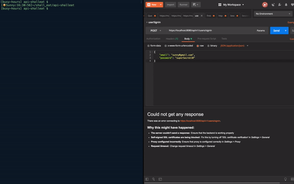
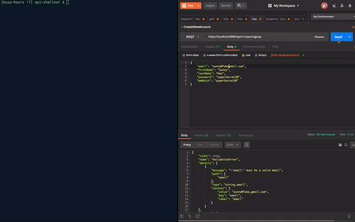
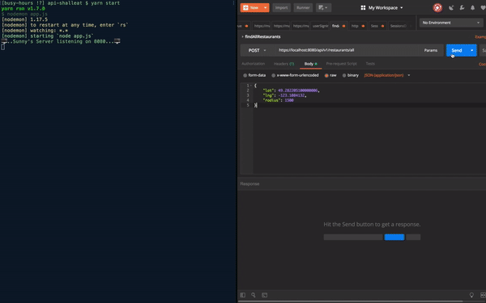

# Shall Eat?

Node Web API SSL server that fetches restuarnts data using Google Place API and provide the data to any front end application that has permission to access to this server (server access restricted by cors).

## Demo

> 👇 Send sign in request to the server.

> 

> 👇 Send sign up request to the server.

> 

> 👇 Send request to get restaurants within 1.5km

> 

> 👇 Send request to get restaurant detail

> 

## Getting Started

This server needs front end application to render the fetched JSON from Google Place API

### Prerequisites

1.  You need to install npm or yarn.
2.  You need to get Google Place API here is link (https://cloud.google.com/maps-platform/)
3.  After you get place API key, then follow next instruction.

### Installing

1.  This command to set up REST API server. (100% JavaScript)

```
$ git clone git@github.com:sunny-heo/ShallEat-API.git
```

2.  Assign Google Place API key to `GOOGLE_PLACE_API`. You can find this variable by typing 👇 commands in terminal after you clone this repository.

```
$ cd ShallEat-API

$ mv config/authConfigExample.js config/authConfig.js

$ open src/requests/authConfig.js
```

3.  After you store place api key, then follow next instruction.

4)  Install packages with npm or yarn

```
$ npm install
or
$ yarn install
```

Run server

```
$ npm start
or
$ yarn start
```

\*\* Since this application has nothing to do with rendering restaurants on map, if you want to render this data on Google map, you need to set upt and run React server. You cna get this server from here: https://github.com/sunny-heo/ShallEat-React

## Deployment

This server is currently deployed on Heroku. (<a href="https://shalleatapi.herokuapp.com">ShallEat Web API Server on Heroku</a>)

## Built With

- node
- knex
- objection
- passport
- jsonwebtoken
- express-promise-router

## Usage

### Routes with endpoints

You can send a request to the server with postman. It might take a while to get response due to the latency to wake up delopyed server on Heroku.

1.  User Signup.

- `Post`
  ```
  https://shalleatapi.herokuapp.com/api/v1/users/signup
  ```
- `Body`
  ```json
  {
    "email": "your email",
    "firstName": "Sunny",
    "lastName": "Heo",
    "password": "superSecret1@",
    "pwMatch": "superSecret1@"
  }
  ```

2.  User Signin.

- `Post`
  ```
  https://shalleatapi.herokuapp.com/api/v1/users/signin/
  ```
- `Body`
  ```json
  {
    "email": "your email",
    "password": "superSecret1@"
  }
  ```

3.  Find Near By restaurants with given geolocation and radius.

- `Post`

  ```
  https://shalleatapi.herokuapp.com/api/v1/restaurants/all
  ```

- `Body`
  ```json
  {
    "lat": 49.282205100000006,
    "lng": -123.1084132,
    "radius": 1500
  }
  ```

4.  Fetch next batch of restaurants with given page token from goolge(next_page_token will be contained in response from goolge if there are more than 20 places in findNearBy request.)

- `Post`
  ```
  https://shalleatapi.herokuapp.com/api/v1/restaurants/next
  ```
- `Body`
  ```json
  {
    "pageToken":
      "CtQDxQEAAPDgzQt4x2TNWIW1rV6utshOuhRBISEa7HnJhW8Sr2pxw0EU7xj3UpAw5Vqu8AcdOu5pfy7036RFR4aOyM27z52FJii689_K6x81AgmhzX_YfHnaERJL8hT9NsBi0mfZ3E1sjYXFVMrJSvShuJiWo2WWeqRLzUHvW8Vi15mlWXnXu6LgyM7aJTu1vbk2FpDuIax8hDXjuj__Lc4Ur2P5B1GeVtmETSE2hYUOXZJZX2SnLS-rMgPWPaQp3U0hR0QkiQowwWMvMx4F2Ar5tvwnVLkN4O3Bzfqeg32BNfVTbkHwhvMto1HeH25AfPyq2HAQyc8IpcHg1GYQAR2WKAUYav1FpZCLc3N7ktvRmKd_F4ROLj9cgGvDBQFri-EJf4BHSDbIKbLPPgJELqynsnREUxJc9cZ-lhZLXX5NbdBl23L04CDNaWJZSBE0lXrcL9e-XnEz5bIEO7p1EGDPjsh_CcvKAp1vRk7cttWmy00tOSFFqOODqALXDRGL3hzDf8IC9uim9SOKogLlf5ncmGRqC73rioGGLQnK2xQVm3uKMOPruSSVP7rEwcsxjMO6kwunbspvcRY1eGhT6Sqac5dP1G4SHYEQFU_4T8umCMA"
  }
  ```

5.  Fetch detail infomration for a restaurant that matches placeId.

- `Post`

  ```
  https://shalleatapi.herokuapp.com/api/v1/restaurants/detail
  ```

- `Body`
  ```json
  {
    "placeId": "ChIJN5hRHoB2hlQRAPQowBSPwLA",
    "filters": [
      "formatted_phone_number",
      "reviews",
      "price_level",
      "website",
      "photos",
      "formatted_address"
    ]
  }
  ```

6.  Fetch schedule for a restaurant that matches placeId. This response will return processed business hours to calculate remaining time until closing or opening businesses in front-end side by parsing original business hours given by Google Place API.

- `Post`
  ```
  https://shalleatapi.herokuapp.com/api/v1/restaurants/schedule
  ```
- `Body`
  ```json
  {
    "photoId":
      "CnRtAAAATLZNl354RwP_9UKbQ_5Psy40texXePv4oAlgP4qNEkdIrkyse7rPXYGd9D_Uj1rVsQdWT4oRz4QrYAJNpFX7rzqqMlZw2h2E2y5IKMUZ7ouD_SlcHxYq1yL4KbKUv3qtWgTK0A6QbGh87GB3sscrHRIQiG2RrmU_jF4tENr9wGS_YxoUSSDrYjWmrNfeEHSGSc3FyhNLlBU",
    "maxWidth": 400
  }
  ```

7.  Fetch photo url

- `Post`

  ```
  https://shalleatapi.herokuapp.com/api/v1/restaurants/photo
  ```

- `Body`

  ```json
  {
    "photoId":
      "CnRtAAAATLZNl354RwP_9UKbQ_5Psy40texXePv4oAlgP4qNEkdIrkyse7rPXYGd9D_Uj1rVsQdWT4oRz4QrYAJNpFX7rzqqMlZw2h2E2y5IKMUZ7ouD_SlcHxYq1yL4KbKUv3qtWgTK0A6QbGh87GB3sscrHRIQiG2RrmU_jF4tENr9wGS_YxoUSSDrYjWmrNfeEHSGSc3FyhNLlBU",
    "maxWidth": 400
  }
  ```
